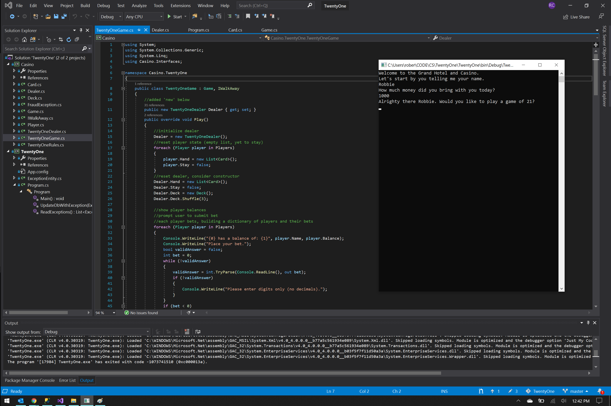

# A game of 21



## Some Code Snippets

### The Card Object
Building this game of 21 started with building the Casino dll that could be used by other similar games.
In a Casino, one thing that you're sure to have is a deck of cards:

```c#
namespace Casino
{
    public struct Card
    {
        public Suit Suit { get; set; }
        public Face Face { get; set; }
        public override string ToString()
        {
            return string.Format("{0} of {1}", Face, Suit);
        }
    }

    public enum Suit
    {
        Spades,
        Hearts,
        Clubs,
        Diamonds
    }
    public enum Face
    { 
        Two, 
        Three, 
        Four, 
        Five, 
        Six, 
        Seven, 
        Eight, 
        Nine, 
        Ten, 
        Jack, 
        Queen, 
        King, 
        Ace 
    }
}
```
### The Deck
```c#
using System;
using System.Collections.Generic;

namespace Casino
{
    public class Deck
    {
        public Deck()
        {
            //create a list of cards (pre-instantiated below)
            //
            Cards = new List<Card>();
            for (int i = 0; i < 13; i++)
            {
                for (int j = 0; j < 4; j++)
                {
                    Card card = new Card();
                    card.Face = (Face)i;
                    card.Suit = (Suit)j;

                    Cards.Add(card);
                }
            }
        }

        //instantiate the list of cards, property of Deck, outside of constructor
        public List<Card> Cards { get; set; }

        //create a method (outside of main) for shuffling the deck
        public void Shuffle(int times = 1)
        {
            //shuffle the deck "times" times (default = 1)
            for (int i = 0; i < times; i++)
            {

                //instantiate a temporary list to store cards
                List<Card> tempList = new List<Card>();
                Random random = new Random();

                //pop and push random cards from initial deck
                while (this.Cards.Count > 0)
                {
                    int randomIndex = random.Next(0, this.Cards.Count);
                    tempList.Add(this.Cards[randomIndex]);
                    this.Cards.RemoveAt(randomIndex);
                }
                this.Cards = tempList;
            }
        }

    }
}
```
### And the Dealer
```c#
using System;
using System.Collections.Generic;
using System.Linq;
using System.IO;

namespace Casino
{
    public class Dealer
    {
        public string Name { get; set; }
        public Deck Deck { get; set; }
        public int Balance { get; set; }


        public void Deal(List<Card> Hand)
        {
            Console.WriteLine(Deck.Cards.First().ToString() + "\n");
            string card = string.Format(Deck.Cards.First().ToString() + "\n");
            Hand.Add(Deck.Cards.First());
            //log dealt cards to text file, example dir
            using (StreamWriter file = new StreamWriter(@"C:\Users\rober\CS\advanced\TwentyOne\Logs\log.txt", append: true))
            {
                file.WriteLine(DateTime.Now);
                file.WriteLine(card);
            }
            Deck.Cards.RemoveAt(0);
        }
    }
```
